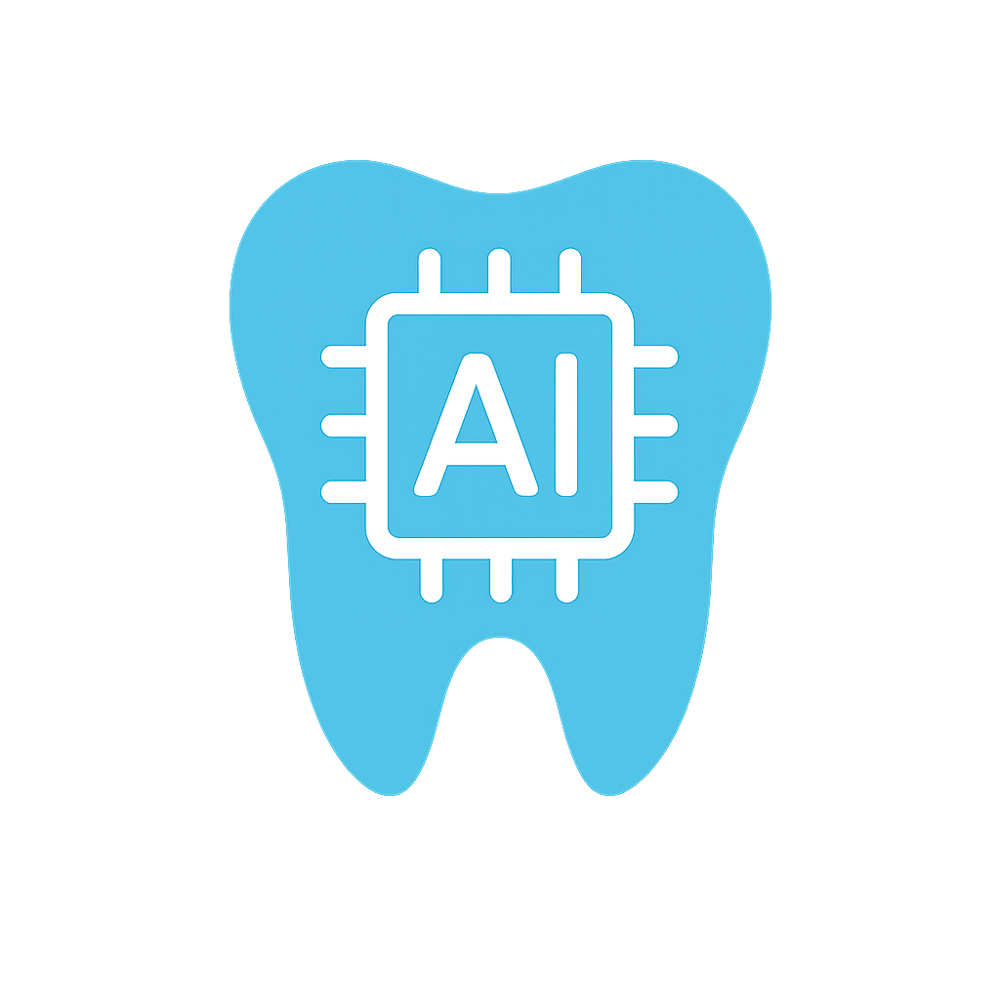

# DentAI - Smart Dental Charting System



## Project Overview

DentAI is a modern, AI-powered dental charting system designed to streamline dental practice management and improve patient care. Our platform combines intuitive dental charting with smart treatment planning and scheduling capabilities, enhanced by natural language processing for hands-free operation.

### 🎯 Goals

- Simplify dental charting with an intuitive, interactive interface
- Streamline treatment planning and appointment scheduling
- Improve patient care through better visualization and tracking
- Reduce administrative overhead in dental practices
- Enable data-driven decisions in dental treatment
- Enable hands-free operation through voice commands

### 🚀 Key Features

1. **Interactive Dental Chart**
   - Visual representation of all 32 teeth
   - Surface-level condition marking
   - Color-coded conditions for easy identification
   - Real-time updates
   - Voice-controlled annotation through natural language processing

2. **Smart Treatment Planning**
   - Automatic treatment suggestions based on marked conditions
   - Detailed cost estimates
   - Treatment prioritization
   - Integrated scheduling system
   - Voice-to-text treatment plan generation

3. **Appointment Scheduling**
   - Treatment-specific appointment booking
   - 30-minute time slot intervals
   - Business hours optimization
   - Visual schedule management

4. **Patient Information Management**
   - Comprehensive patient profiles
   - Treatment history tracking
   - Notes and observations recording
   - Progress monitoring
   - Voice-to-text note taking

5. **Voice Control & AI Interpretation**
   - Real-time audio input processing
   - LLM-powered dental terminology interpretation
   - Natural language to dental chart mapping
   - Context-aware command processing
   - Multi-language support for international practices

### 💻 Technical Stack

- **Frontend**: React with TypeScript
- **Styling**: Tailwind CSS
- **Icons**: Lucide React
- **State Management**: React Context
- **Build Tool**: Vite
- **AI/ML**: Large Language Models (LLM)
- **Audio Processing**: Web Speech API
- **Natural Language Processing**: Custom dental terminology models

### 🔄 Current Status

The project is currently in active development with the following components completed:
- Dental chart visualization
- Condition marking system
- Treatment planning interface
- Appointment scheduling
- Basic patient information management

### 🤝 How to Contribute

We welcome contributions in the following areas:

1. **Feature Development**
   - Enhanced AI capabilities for treatment suggestions
   - Integration with dental imaging systems
   - Patient communication features
   - Reporting and analytics

2. **UI/UX Improvements**
   - Accessibility enhancements
   - Mobile responsiveness
   - Print-friendly layouts
   - Dark mode support

3. **Documentation**
   - User guides
   - API documentation
   - Setup instructions
   - Best practices

4. **Testing**
   - Unit tests
   - Integration tests
   - User acceptance testing
   - Performance testing

### 🛠️ Getting Started

1. Clone the repository
```bash
git clone https://github.com/yourusername/dentai.git
```

2. Install dependencies
```bash
cd dentai
npm install
```

3. Start the development server
```bash
npm run dev
```

### 📝 Future Plans

1. **AI Integration**
   - Automated condition detection from X-rays
   - Treatment success prediction
   - Personalized treatment recommendations
   - Risk assessment

2. **Enhanced Features**
   - Multi-provider scheduling
   - Insurance integration
   - Patient portal
   - Mobile application

3. **Integration Capabilities**
   - Electronic Health Records (EHR) integration
   - Dental imaging system integration
   - Insurance verification
   - Payment processing

### 👥 Team

We're looking for passionate contributors with experience in:
- Frontend Development (React, TypeScript)
- UI/UX Design
- Dental Informatics
- Machine Learning/AI
- Healthcare Integration

### 📬 Contact

For questions, suggestions, or collaboration opportunities, please reach out to:
- Email: contact@dentai.com
- GitHub Issues: [Create an issue](https://github.com/yourusername/dentai/issues)
- Discord: [Join our community](https://discord.gg/dentai)

### 📄 License

This project is licensed under the MIT License - see the [LICENSE](LICENSE) file for details. 